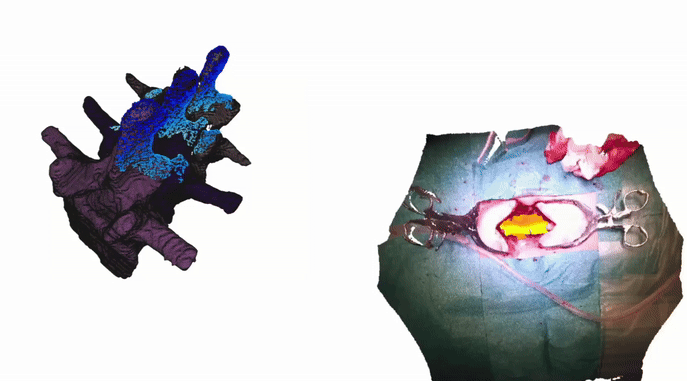
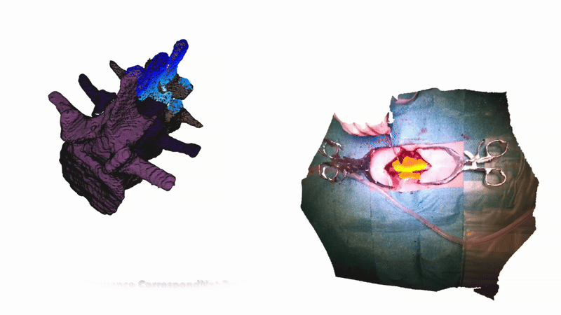

# SpineAlign

  
  

This is the accompanying code repository for the paper "Towards Markerless Intraoperative Tracking of Deformable Spine Tissue", by Connor Daly[1], Dr Elettra Marconi[2], Professor Marco Riva[2], Dr Jinendra Ekanayake[3], Professor Daniel Elson[1] and Professor Ferdinando Rodriguez y Baena[1]. 
[1] Imperial College London
[2] Humanitas University
[3] Stanford University

For any questions regarding this repository or paper, please contact Connor (cd1723{at}ic[dot]ac[dot]uk)

This paper presents the first attempt at crossing the cadaver-to-clinical gap for markerless tracking.
The accompanying dataset can be found [here](https://huggingface.co/datasets/zcbecda/SpineAlign/tree/main).
After cloning this repository, create a CT_DATA folder within SpineAlign, and add the files index_data_map_new_with_meshes_combined.pkl and folder CT_PROXY_LABELS from huggingface to this folder.

  
  

